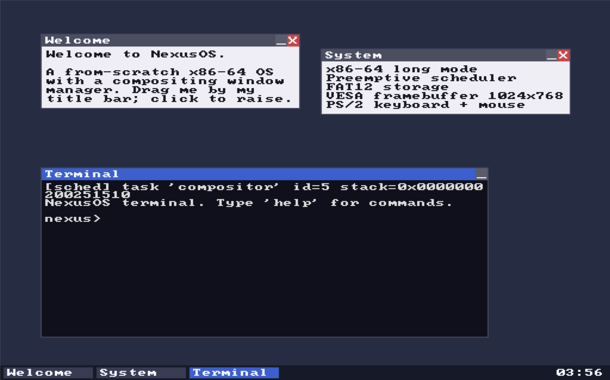

# 1. Introduction: what is an OS, and what will we build?

[← Home](README.md) · [Next: Toolchain →](02-toolchain-setup.md)

## What *is* an operating system?

When you turn on a computer, the CPU starts executing instructions with no
help: no files, no windows, no `printf`. An **operating system** is the program
that takes that bare machine and turns it into something usable — it manages the
CPU, memory, and devices, and provides services (like "run this program" or
"read this file") to everything else.

At its core an OS does a few jobs:

- **Boot** — get the CPU from its primitive power-on state into a sane
  environment where your code can run.
- **Manage memory** — keep track of physical RAM and hand out chunks safely.
- **Manage the CPU** — let multiple things appear to run at once (scheduling).
- **Talk to devices** — keyboard, screen, disk, mouse (drivers).
- **Provide services** — a filesystem, a shell, eventually programs and a GUI.

That's it. It feels like magic from the outside, but each piece is
understandable on its own. This wiki walks through them one at a time.

## What we'll build

We'll build a small but genuinely real OS for the **x86-64** PC. The reference
implementation, **NexusOS**, boots on QEMU and on actual hardware, and includes:

- a from-scratch BIOS bootloader (no GRUB),
- a 64-bit kernel with interrupt handling,
- physical and virtual memory managers and a heap,
- a preemptive scheduler with mutexes/semaphores,
- a disk driver and a read-only filesystem,
- a framebuffer graphics stack with a compositing window manager and mouse.

Here's the destination — a desktop with draggable windows and a terminal,
running on the OS you'll understand top to bottom:

## Why x86-64 + BIOS?

- **x86-64** is the architecture in most desktops/laptops, and QEMU emulates it
  perfectly, so you can develop without risking your real machine.
- **BIOS/legacy boot** (rather than UEFI) is dramatically simpler to start with
  — a few hundred bytes of assembly get you booting. (UEFI is a worthy later
  project.)

The concepts — booting, memory, scheduling, drivers — transfer to *any*
architecture (ARM, RISC-V). The specific instructions differ; the ideas don't.

## The mindset

Three things make OS dev approachable:

1. **It's incremental.** You'll always have something that boots. Each chapter
   adds one capability. If it breaks, you changed one thing — so you know where
   to look.
2. **The emulator is your friend.** QEMU boots your OS in under a second, can
   show you registers, and can attach a debugger. You'll iterate fast.
3. **Crashes are normal and informative.** A triple-fault reboot or a frozen
   screen isn't failure — it's data. We'll teach you to read it.

## What you need to know

- **C** — structs, pointers, bit operations. We use plain C, no standard library
  (there's no libc on bare metal — *you* are the standard library).
- **A little assembly** — we explain the x86 bits as we go. You don't need to be
  fluent.
- **The command line** — to build and run with `make` and `qemu`.

If a term is unfamiliar (real mode? GDT? page table?), check the
[Glossary](glossary.md) — we define jargon the first time it appears, but the
glossary is there for quick lookups.

## A note on the reference code

Every chapter points at real NexusOS files (e.g. *"see `kernel/idt.c`"*). The
code is original and readable, and it's the best companion to the prose: the
wiki explains the *ideas*, the code shows a *complete working version*. Read
both.

Ready? Let's set up your tools and get something booting.

[← Home](README.md) · [Next: Toolchain and first boot →](02-toolchain-setup.md)
